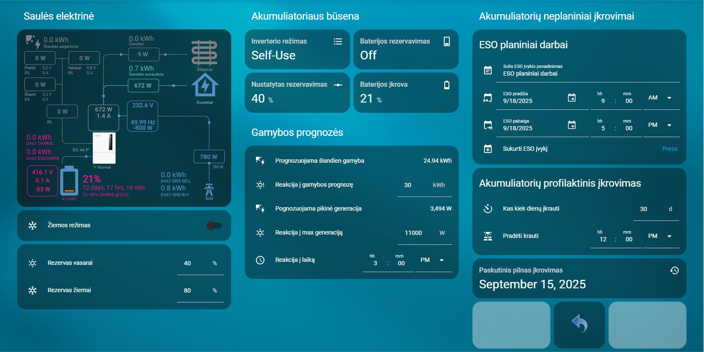

# Home Assistant – Automations & Cards (EN/LT)

🔵 **This is the English version.**  



🟡 [Lietuviška versija](README.md)

This repository contains Home Assistant **automations** and **Lovelace cards** in **English (EN)** and **Lithuanian (LT)**. Lithuanian is the default; each folder has an EN counterpart.

## Structure
```
automations/
  ├─ lt/  # Lithuanian automation YAML
  └─ en/  # English automation YAML
cards/
  ├─ lt/  # Lithuanian Lovelace card YAML
  └─ en/  # English Lovelace card YAML
helpers/
  ├─ lt/helpers_lt.yaml  # LT helpers with icons
  └─ en/helpers_en.yaml  # EN helpers with icons
```

## How to use
1. **Helpers**  
   - YAML users: include `helpers/en/helpers_en.yaml` **or** `helpers/lt/helpers_lt.yaml` in `configuration.yaml` via `!include`.
   - If helpers exist via UI, use these as naming/icon references (or set via `homeassistant: customize:`).

2. **Automations**  
   - Copy the chosen language `.yaml` files into `config/automations/` and **reload automations**.

3. **Cards**  
   - Add card YAML to your dashboard (Raw configuration editor) or include via `!include`.

> English versions use renamed `entity_id`s (e.g., `Solis` → `Solar`, `eso` → `grid`). Lithuanian versions keep original IDs.

## License
MIT License — use freely; link back appreciated.
