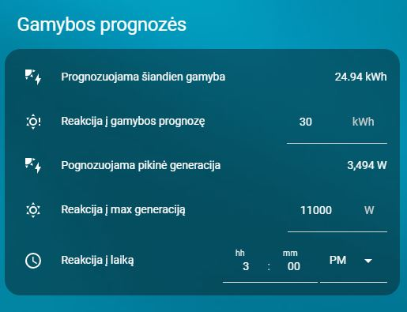

# Home Assistant – Solis baterijų krovimo automatikos ir kortelės (LT/EN)

<a href="https://buymeacoffee.com/omenukas">
  
</a>


🟡 **Ši versija – lietuvių kalba.**  
🔵 [English version](README.en.md)

## Apžvalga

Šiame repozitoriume pateikiu keletą automatizacijų, kurios galėtų padėti valdyti ir prižiūrėti, kaupiklius, prijungtus prie Jūsų Solis įtampos keitiklio. Galima automatizacijas pritaikyti ir kitų gamintojų įtampos keitikliams, parenkant tinkamus sensorius, tačiau šis projektas paruoštas, naudojant [Solis modbus](https://github.com/Pho3niX90/solis_modbus) integraciją. Kadangi naudoju Waveshare modbus keitiklį, tai Solis integracijoje sensoriai turi atitinkamus pavadinimus, kuriuos automatizacijose jums gali reikėti pakoreguoti pagal savo sensorių atitinkamus pavadinimus.
Mano Solis dashboard'as atrodo taip:
 


Home Assistant **automatizacijos** ir **Lovelace kortelės** pateikiamos dviem kalbomis: **lietuviškai (LT)** ir **angliškai (EN)**. LT yra numatytoji; kiekviename kataloge yra atitikmuo EN.

## Struktūra
```
automations/
  ├─ lt/  # lietuviškos automatikos (YAML)
  └─ en/  # angliškos automatikos (YAML)
cards/
  ├─ lt/  # lietuviškos Lovelace kortelės (YAML)
  └─ en/  # angliškos Lovelace kortelės (YAML)
helpers/
  ├─ lt/helpers_lt.yaml  # LT helperių aprašymai su ikonėlėmis
  └─ en/helpers_en.yaml  # EN helperių aprašymai su ikonėlėmis
```

## Kaip naudoti
1. **Helperiai**
   Automatizacijose ir kortelėse naudojama visa eilė helper tipo subjektų (entity). Todėl pradžioje reikia sukurti visus reikalingus helper'ius. **SVARBU** naudoti tos pačios kalbos automatizacijas, korteles ir helper'ius - Visi komponentai turi būti arba tik angliški arba tik lietuviški.
   - YAML naudotojams: įtraukite `helpers/lt/helpers_lt.yaml` **arba** `helpers/en/helpers_en.yaml` į `configuration.yaml`.
   - Jei helperius kūrėte per UI, tai šiuos failus naudokite kaip pavyzdį pavadinimams/ikonėlėms. Nepamirškite patikrinti ar susikūrė tiksliai toks Entity ID.

2. **Automatikos**  
   - Automatizacijų failai pritaikyti copy/paste į naują UI automatizacijos skriptą:
Sukurti naują automatizaciją - Settings->Automations&Scenes->+Create automation->pasirenkama "Create new automation"->dešiniame viršutiniame kampe paspausti ant 3 taškų->pasirinkti "Edit in YAML"-> atsidariusiame lange išvalyti, kad neliktų jokio įrašo ir įklijuoti pasirnkto automatizacijos .yaml failo turinį ->Save.
Taip pat .yaml turinį galite įdėti tiesiai į `config/automations/` (reikės pakoreguoti skripto sintaksę) ir **perkraukite automatikas**.

## Automatikų paaiškinimai
**Akumuliatorių įkrovimas nuo saulės – dienos logika**



Šiam scriptui reikalinga papildoma [Solcast_forecast](https://github.com/david-rapan/ha-solcast)  integracija į Home Assistant. 
Iš šios integracijos bus naudojama pora sensorių einamos dienos prognozuojamai gamybai ir maksimaliai generacijai įvertinti.
Paskirtis - įvertinti ar numatoma pakankama elektos gamyba iš saulės ir pagal tai suplanuoti, kada bus kraunamos baterijos, kad nakčiai jos būtų pilnai įkrautos.
Kaip tai veikia:
- žinodami savo dienos elektros poreikį ir baterijų talpą, galite numatyti, koks reikalingas energijos kiekis, kad dienos metu būtų patenkinami momentinio elektros suvartojimo poreikiai ir, kad įkrauti iki 100% baterijas. Ši reikšmė įrašoma kortelėje į `Reakcija į gamybos prognozę`. Jeigu prognozė yra mažesnė, nei jūsų užduota, tai inverteris visą dieną dirbs "Self use" režimu, taip suteikdamas pirmenybę baterijų įkrovimui.
- Tuo atveju, jeigu prognozuojama gamyba yra didesnė, nei jūsų užduota, taikrinama ar numatomas generacijos pikas yra didesnis, nei jūsų užduotas `Reakcija į max generaciją`. Jeigu ši prognozė yra mažesnė, nei jūsų užduota reikšmė, tai inverteris lieka dirbti "Self use" režimu. Jeigu prognozė didesnė, nei jūsų užduota - inverteris persijungia į "Selling first" režimą, taip suteikdamas pirmenybę atiduoti pagamintą elektros energiją į tinklą.
- Kodėl tokia logika: Elektros tinklai nustato leidžiamą generuoti į tinklą galią, ir ją pasiekus, reikia riboti arba gamybą arba perteklių atiduoti baterijų įkrovimui. Todėl į lauką `Reakcija į max generaciją` patartina įrašyti šiek tiek mažesnę reikšmę, nei jums ESO išdavė sąlygose leistiną generuoti (dėl prognozių paklaidos) ir pradžioje baterijos nebus kraunamos, kad jeigu vis viršijama leistina gamybą, tai tą perviršį panaudos baterijų įkrovimui. Jeigu prognozė rodo, kad nebus viršyjama leidžiama riba, tai laikyti neįkrautus akumuliatorius nėra prasmės ir inverteris gali nuo pačio ryto krauti baterijas, o joms pilnai įsikrovus, perteklių atiduoti į tinklus.
- `Reakcija į laiką` - įrašote laiką, kada akumuliatoriai turi būti jau pilnai įkrauti. Jeigu inverteris dirbs "Selling first" režimu, tai bus perjungtas į "Self use", kad pilnai įkrauti baterijas, jei iki to laiko dar nebuvo tai padaryta.
 Padariau rankinį laiko pasirinkimą, nes nesugalvojau, kaip tą galima būtų automatizuoti, įvertinant metų laikus (kada pradeda saulė leisti), kitus galimus faktorius.


- Ryte 05:00 tik
3. **Kortelės**  
   - Kortelių YAML įkelkite į dashboard’ą (Raw configuration editor) arba įtraukite per `!include`.


Jeigu patiko mano darbas, visada galite tai įvertinti 
<a href="https://buymeacoffee.com/omenukas">
  
</a>
