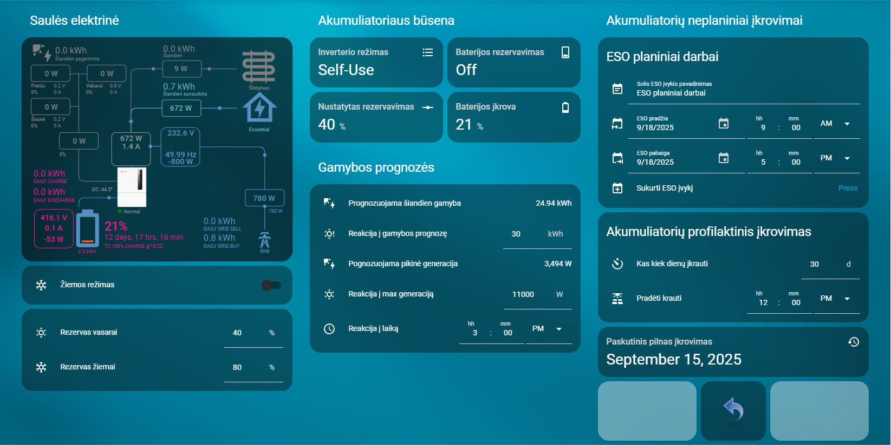

# Home Assistant – Solis baterijų krovimo automatikos ir kortelės (LT/EN)

<a href="https://buymeacoffee.com/omenukas">
  
</a>


🟡 **Ši versija – lietuvių kalba.**  
🔵 [English version](README.en.md)

## Apžvalga

Šiame repozitoriume pateikiu keletą automatizacijų, kurios galėtų padėti valdyti ir prižiūrėti, kaupiklius, prijungtus prie Jūsų Solis įtampos keitiklio. Galima automatizacijas pritaikyti ir kitų gamintojų įtampos keitikliams, parenkant tinkamus sensorius, tačiau šis projektas paruoštas, naudojant [Solis modbus](https://github.com/Pho3niX90/solis_modbus)
 integraciją.




Šiame repozitoriume – Home Assistant **automatizacijos** ir **Lovelace kortelės** dviem kalbomis: **lietuviškai (LT)** ir **angliškai (EN)**. LT yra numatytoji; kiekviename kataloge yra atitikmuo EN.

## Struktūra
```
automations/
  ├─ lt/  # lietuviškos automatikos (YAML)
  └─ en/  # angliškos automatikos (YAML)
cards/
  ├─ lt/  # lietuviškos Lovelace kortelės (YAML)
  └─ en/  # angliškos Lovelace kortelės (YAML)
helpers/
  ├─ lt/helpers_lt.yaml  # LT helperių aprašymai su ikonėlėmis
  └─ en/helpers_en.yaml  # EN helperių aprašymai su ikonėlėmis
```

## Kaip naudoti
1. **Helperiai**  
   - YAML naudotojams: įtraukite `helpers/lt/helpers_lt.yaml` **arba** `helpers/en/helpers_en.yaml` į `configuration.yaml` (`!include`).
   - Jei helperius kūrėte per UI, šiuos failus naudokite kaip pavyzdį pavadinimams/ikonėlėms (arba per `homeassistant: customize:`).

2. **Automatikos**  
   - Pasirinktos kalbos `.yaml` nukopijuokite į `config/automations/` ir **perkraukite automatikas**.

3. **Kortelės**  
   - Kortelių YAML įkelkite į dashboard’ą (Raw configuration editor) arba įtraukite per `!include`.

> EN versijose `entity_id` pervadinti (pvz., `Solis` → `Solar`, `eso` → `grid`). LT versijose liko originalūs pavadinimai.

Jeigu patiko mano darbas, visada galite tai įvertinti 
<a href="https://buymeacoffee.com/omenukas">
  
</a>
