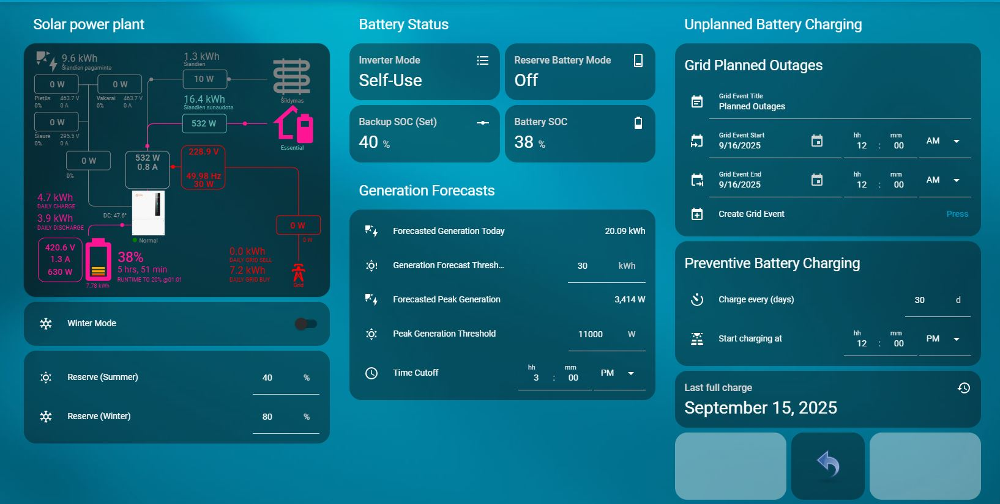
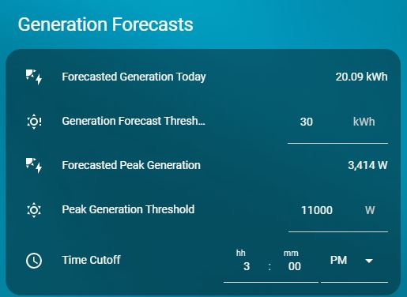
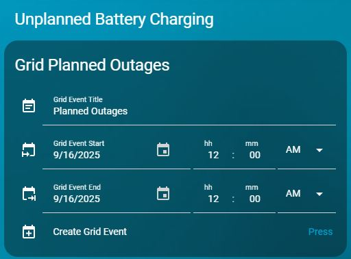
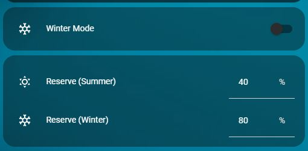
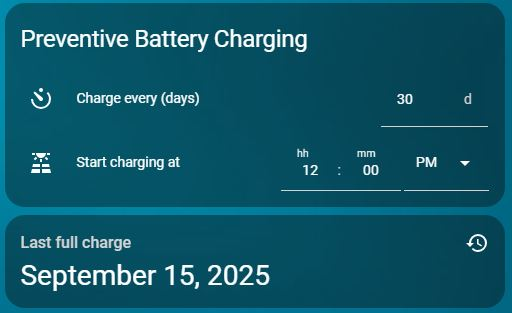

# Home Assistant – Solis Battery Charging Automations & Cards (LT/EN)

<a href="https://buymeacoffee.com/omenukas">
  
</a>

🔵 **This is the English version.**  *(Translated from the original Lithuanian description with the help of ChatGPT)*

🟡 [Lietuviška versija](README.lt.md)

## Overview

This repository contains several automations that help operate and maintain batteries connected to a **Solis** inverter. You can adapt the logic to other inverter brands by selecting the appropriate sensors; however, this project is built around the [Solis modbus](https://github.com/Pho3niX90/solis_modbus) integration.  
I use a **Waveshare** Modbus adapter, so my Solis sensor entity IDs follow that naming. You will likely need to adjust the entity IDs to match your setup.

My Solis dashboard looks like this:



Home Assistant **automations** and **Lovelace cards** are provided in two languages: **Lithuanian (LT)** and **English (EN)**. LT is the default; every directory has an EN counterpart.

## Structure
```
automations/
  ├─ lt/  # Lithuanian automations (YAML)
  └─ en/  # English automations (YAML)
cards/
  ├─ lt/  # Lithuanian Lovelace cards (YAML)
  └─ en/  # English Lovelace cards (YAML)
helpers/
  ├─ lt/helpers_lt.yaml  # LT helpers with icons
  └─ en/helpers_en.yaml  # EN helpers with icons
```

## How to use
1. **Helpers**  
   These automations and cards rely on multiple **helpers** (entities). Please create them first. **IMPORTANT:** use a single language across automations, cards, and helpers — either **English only** or **Lithuanian only**.
   - YAML users: include `helpers/en/helpers_en.yaml` **or** `helpers/lt/helpers_lt.yaml` in `configuration.yaml`.
   - If you created helpers via the UI, use the files as a reference for names/icons and **double‑check the Entity IDs**.

2. **Automations**  
   - The provided YAML is ready for **copy/paste into a new UI automation**:  
     *Settings → Automations & Scenes → + Create automation → Create new automation → (top‑right) ⋮ → Edit in YAML →* clear the editor and paste the selected automation’s `.yaml` → **Save**.
   - Alternatively, place the YAML into `config/automations/` (you may need to adapt the script block format) and **reload automations**.

## Automations explained

**Battery charging from solar – daytime logic**

> [!IMPORTANT]
> **NOTE:** this automation is intended for setups where the PV system’s **instantaneous feed‑in limit** (as defined by your grid operator) can be exceeded, the user is on a **fixed‑rate electricity plan** and uses **net‑metering**. If you have **net‑billing**, **exchange/spot‑price plans**, or want to participate in **grid balancing**, you’ll need different automations (I may add them in the future).



This script requires an additional Home Assistant integration: [Solcast_forecast](https://github.com/david-rapan/ha-solcast).  
It uses a couple of sensors to evaluate **today’s total generation forecast** and **today’s peak generation**.  
**Goal:** decide whether there will be enough solar production today and plan when to charge the batteries so they reach **100% by night**.

How it works:
- Knowing your **daily consumption** and **battery capacity**, determine the energy you want covered by solar to meet daytime loads and still charge batteries to 100%. Enter that value on the card in **“Generation Forecast Threshold”**. If the forecast is **lower** than your threshold, the inverter stays in **“Self use”** for the day, prioritising battery charging.
- If the **total forecast** is higher than your threshold, the automation checks today’s **peak generation forecast** against **“Peak Generation Threshold”**. If the peak is **below** your threshold, the inverter **remains in “Self use”**. If the peak is **higher**, the inverter **switches to “Selling first”**, prioritising export to the grid.
- **Why this logic:** grid operators define a **maximum permitted feed‑in power**. When you’re likely to exceed it, you want that surplus to go into the batteries instead of being curtailed. Therefore, set **“Peak Generation Threshold”** **slightly lower** than your permitted feed‑in limit (to account for forecast error). If the forecast suggests you **won’t** exceed the limit, there’s no point keeping the batteries low — let the inverter charge them from the morning and export the excess later.
- **“Time Cutoff”** — set the time by which the batteries **must be full**. If the inverter is still in **“Selling first”** near that time, it will switch back to **“Self use”** to finish charging to 100%.

Download the card — **[Solar Generation Forecasts card](cards/en/cards_en_generation_forecasts.yaml)**  
Download the automation — **[Solar Daytime Charging](automations/en/solar_daytime_charging.yaml)**

---

**Planned grid outages**



In my area, planned outages are almost always **in the morning**, when the batteries have **discharged overnight** and the PV system has not yet ramped up. When you receive a planned‑outage notice from the grid operator, you can make sure the batteries are **fully charged on that day**.

This requires the **Local Calendar** integration. Create a calendar named exactly **“grid planned outages”** so the entity becomes **`calendar.grid_planned_outages`**:  
*Home Assistant → Settings → Devices & Services → + Add integration → “Local calendar” →* set **Calendar name** to `grid planned outages` and tick **Create an empty calendar** → **Submit** → **Finish**.  
Verify the entity exists as **`calendar.grid_planned_outages`**.

How it works:
- After receiving the notice, enter the **start** and **end** date/time in the **Grid Planned Outages** card. Click **“Create Grid Event”** — an event will be added to the calendar for that day.
- At **00:00** on the planned day, the automation:
  - turns **on** `switch.grid_time_of_use_charging_period_1` (forced charging from grid). Prepare this TOU slot on the inverter in advance. My Solis HV battery defaults:  
    **Charge Time Slot 1:** `00:00–06:00` · **Charge Current 1:** `20A` · **SOC1:** `100%`.  
    (Settable either in SolisCloud or via the Solis Modbus integration.)
  - turns **on** `input_boolean.manual_battery_reserve` — a HA virtual switch used to temporarily suspend other charging automations.
  - turns **on** `switch.reserve_battery_mode` — I normally keep the inverter’s reserve mode **off**, so here it is enabled temporarily to keep batteries full until the outage.
  - remembers the current `number.solis_waveshare_backup_soc`, then **sets it to 100** to prevent discharge before the outage.
- Charging from grid starts. Once the batteries reach **100%**, `switch.grid_time_of_use_charging_period_1` is **turned off**, but reserve mode **remains on** and backup SOC stays **100%**. The automation then **waits** for either a **phase voltage drop** (outage begins) or the **calendar end time**. When either occurs, it **restores** the inverter settings and resumes normal logic (e.g., **Winter Mode** if it was enabled).

Download the card — **[Grid Planned Outages card](cards/en/cards_en_grid_planned_outages.yaml)**  
Download the automation — **[Grid Planned Outage – Preparation & Restore](automations/en/grid_planned_outage_prep_restore.yaml)**  
Download the event‑creation automation — **[Create Grid Event from Card](automations/en/grid_create_event_from_card.yaml)**

---

**Winter Mode**



In winter, solar generation is low while heating loads are higher, so batteries are less useful for daily cycling — but they still serve their **backup** role. This automation:

- When **Winter Mode** is turned **on** on the card, it **enables** the inverter’s **reserve/backup mode** and sets **backup SOC** to the value from **“Reserve (Winter)”**. While grid power is available, the batteries **will not discharge below** that threshold.
- When Winter Mode is turned **off**, it **disables** reserve mode and sets backup SOC to **“Reserve (Summer)”**. (I keep this value for potential future use, even though reserve mode is off in summer.)
- Safety interlock: execution is aborted if `input_boolean.manual_battery_reserve` is **on** — other charging workflows can take priority.

Download the card — **[Winter Mode & Reserves card](cards/en/cards_en_winter_mode_reserves.yaml)**  
Download the automation — **[Winter Mode Reserve](automations/en/winter_mode_reserve.yaml)**

---

**Preventive battery charging**



In winter, batteries rarely reach **100%** from solar alone, which may accelerate **degradation** over long periods. This automation ensures a **periodic full charge**.

- Runs **only when Winter Mode is enabled**.
- On the card, set the **charging interval (days)** and the **start time** for forced grid charging.
- The automation turns **on** `switch.grid_time_of_use_charging_period_2` (forced charging from grid). Prepare this TOU slot in advance. My defaults:  
  **Charge Time Slot 2:** `00:00–00:00` · **Charge Current 2:** `20A` · **SOC2:** `100%`.

Download the card — **[Preventive Battery Charging card](cards/en/cards_en_preventive_battery_charging.yaml)**  
Download the automation — **[Solar – Periodic Charging](automations/en/solar_periodic_charging.yaml)**

## Final words

I’m still a relatively new user of a hybrid PV‑battery system, so there is always room for improvement and I may have missed some edge cases. Feedback and suggestions are welcome, and I’ll keep refining these automations as time permits.

If you find this useful, you can support my work:

<a href="https://buymeacoffee.com/omenukas">
  
</a>
