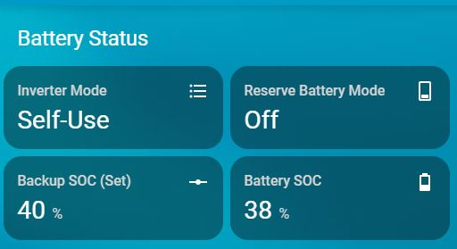

# Battery Status

**Displays inverter mode, reserve states, and battery SOC.**

- YAML: `../../cards/en/en/cards_en_battery_status.yaml`
- [Lithuanian version](../lt/cards_en_battery_status.md)

## Dependencies
- `number.solis_waveshare_backup_soc`
- `select.work_mode`
- `sensor.solis_waveshare_battery_soc`
- `switch.reserve_battery_mode`

## How to use
- Copy the YAML into your Home Assistant setup.
- Ensure the required helpers exist (see **Dependencies**).
- Reload automations/cards or restart Home Assistant.

## Preview

