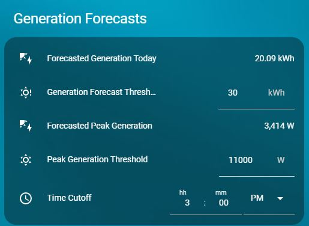

# Generation Forecasts

**Shows today's generation forecast and thresholds.**

- YAML: `../../cards/en/en/cards_en_generation_forecasts.yaml`
- [Lithuanian version](../lt/cards_en_generation_forecasts.md)

## Dependencies
- `input_datetime.time_cutoff`
- `input_number.daily_peak_generation_threshold`
- `input_number.generation_forecast_threshold`
- `sensor.solcast_pv_forecast_forecast_today`
- `sensor.solcast_pv_forecast_peak_forecast_today`

## How to use
- Copy the YAML into your Home Assistant setup.
- Ensure the required helpers exist (see **Dependencies**).
- Reload automations/cards or restart Home Assistant.

## Preview

