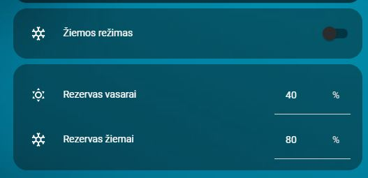

# Cards En Winter Mode Reserves

**Manages battery reserve and inverter reserve mode for winter season.**

- YAML: `../../cards/en/en/cards_en_winter_mode_reserves.yaml`
- [Lithuanian version](../lt/cards_en_winter_mode_reserves.md)

## Dependencies
- `input_boolean.solar_winter_mode`
- `input_number.battery_reserve`
- `input_number.battery_reserve_summer`

## How to use
- Copy the YAML into your Home Assistant setup.
- Ensure the required helpers exist (see **Dependencies**).
- Reload automations/cards or restart Home Assistant.

## Preview

