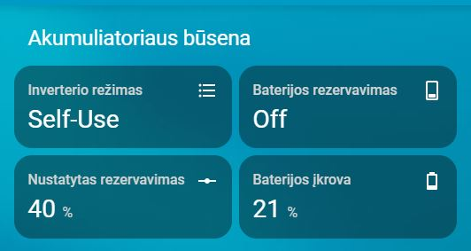

# Akumuliatoriaus būsena

**Kortelė rodo inverterio režimą, rezervus ir akumuliatoriaus įkrovą.**

- YAML: `../../cards/lt/lt/lt_battery_status.yaml`
- [English version](../en/lt_battery_status.md)

## Priklausomybės
- `number.solis_waveshare_backup_soc`
- `select.work_mode`
- `sensor.solis_waveshare_battery_soc`
- `switch.reserve_battery_mode`

## Kaip naudoti
- Nukopijuokite YAML į savo Home Assistant.
- Įsitikinkite, kad reikalingi helperiai sukurti (žr. **Priklausomybės**).
- Perkraukite automatikas/korteles arba Home Assistant.

## Peržiūra

