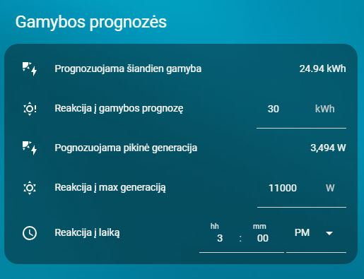

# Gamybos prognozės

**Kortelė su šiandienos gamybos prognoze ir slenksčiais.**

- YAML: `../../cards/lt/lt/lt_generation_forecasts.yaml`
- [English version](../en/lt_generation_forecasts.md)

## Priklausomybės
- `input_datetime.reakcija_i_laika`
- `input_number.reakcija_i_dienos_max_generacija`
- `input_number.reakcija_i_gamybos_prognoze`
- `sensor.solcast_pv_forecast_forecast_today`
- `sensor.solcast_pv_forecast_peak_forecast_today`

## Kaip naudoti
- Nukopijuokite YAML į savo Home Assistant.
- Įsitikinkite, kad reikalingi helperiai sukurti (žr. **Priklausomybės**).
- Perkraukite automatikas/korteles arba Home Assistant.

## Peržiūra

