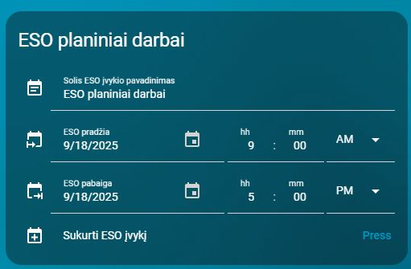

# ESO planiniai darbai

**Pasiruošia planiniam ESO atjungimui ir vėliau atstato nustatymus.**

- YAML: `../../cards/lt/lt/lt_grid_planned_outages.yaml`
- [English version](../en/lt_grid_planned_outages.md)

## Priklausomybės
- `input_button.eso_sukurti`
- `input_datetime.eso_pabaiga`
- `input_datetime.eso_pradzia`
- `input_text.eso_pavadinimas`

## Kaip naudoti
- Nukopijuokite YAML į savo Home Assistant.
- Įsitikinkite, kad reikalingi helperiai sukurti (žr. **Priklausomybės**).
- Perkraukite automatikas/korteles arba Home Assistant.

## Peržiūra

