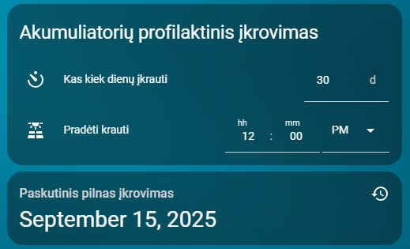

# Akumuliatorių profilaktinis įkrovimas

**Kortelė periodiniam kraunimui ir paskutinio pilno įkrovimo rodymui.**

- YAML: `../../cards/lt/lt/lt_preventive_battery_charging.yaml`
- [English version](../en/lt_preventive_battery_charging.md)

## Priklausomybės
- `input_datetime.solis_krovimo2_laikas`
- `input_datetime.solis_krovimo2_paskutinis_vykdymas`
- `input_number.solis_krovimo2_dienu_intervalas`

## Kaip naudoti
- Nukopijuokite YAML į savo Home Assistant.
- Įsitikinkite, kad reikalingi helperiai sukurti (žr. **Priklausomybės**).
- Perkraukite automatikas/korteles arba Home Assistant.

## Peržiūra

