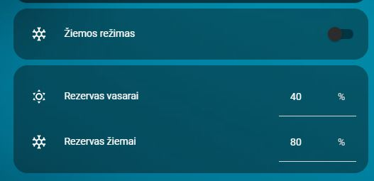

# Lt Winter Mode Reserves

**Valdo akumuliatoriaus rezervą ir inverterio Reserve Mode žiemos sezonui.**

- YAML: `../../cards/lt/lt/lt_winter_mode_reserves.yaml`
- [English version](../en/lt_winter_mode_reserves.md)

## Priklausomybės
- `input_boolean.ziemos_rezimas_elektrinei`
- `input_number.akumuliatoriaus_rezervavimas`
- `input_number.akumuliatoriaus_rezervavimas_vasarai`

## Kaip naudoti
- Nukopijuokite YAML į savo Home Assistant.
- Įsitikinkite, kad reikalingi helperiai sukurti (žr. **Priklausomybės**).
- Perkraukite automatikas/korteles arba Home Assistant.

## Peržiūra

